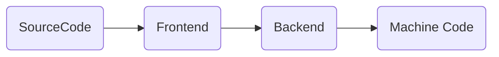

# iOS 编译过程 

## 1. 前言

学习 **iOS** 编译过程（**Compile**）有助于我们更好理解代码是如何被计算机运作起来，编译器为代码做了哪些优化，让我们学会从另一个角度来看待问题。
<!-- more -->
## 2. 编译器结构

现代编译器是将源代码转换成可执行文件的程序，工作流程主要分为 **前端** 和 **后端** 两个部分：

1. 前端：对源代码进行解析，并生成中间代码。
2. 后端：针对中间代码进行优化，并转换成目标机器的代码指令。



针对iOS平台，不同语言采用了不同的编译器前端：

1. **Frontend：Clang / SwiftC**

   对于 **Objective-C / C / C++ / Objective-C++**  来说采用 **Clang** 编译器前端；

   对于 **Swift** 来说则采用 **SwiftC**；

2. **Backend：LLVM**

   无论是 **C** 系语言还是 **Swift** 都采用 **LLVM** 作为编译器后端；

值得注意的是在 **Xcode3** 以前，都采用 **GCC** 作为编译器前端，但为 **Apple** 快速发展需要功能更强大和性能更好的编译器，所以 **Apple** 自己开发了 **Clang** 作为编译器前端。下面对编译器做一个简要介绍：

* **GCC**

**GCC**（**GNU Compile Collection**，**GNU **编译器套装），是一套由 **GNU** 开发的编程语言编译器。来本只能处理 *C* 语言，后来快速演进，变得可处理 **C++、Objective-C、Java、Fortran** 等其他语言。但由于一些缺陷，导致了 **Apple** 抛弃了 **GCC** ，开发出了 **Clang** 作为其前端编译器。

1. **GCC** 的 **Objective-C Frontend** 不是 **Apple** 维护，导致想要添加一些语法提示等功能得去要求 **GCC** 团队做。
2. **GCC** 的插件、工具、**IDE** 的支持薄弱。
3. **GCC** 的编译效率和性能不足。

* **Clang**

**Clang1.0** 于 **2009** 年正式与 **LLVM2.6** 正式发布，旨在提供 **GCC** 的替代品，支持了 **GUN** 编译器大多数的编译器设置以及非官方语言的拓展，相较于 **GCC** ，**Clang** 具有以下优势：

1. 编译速度更快。
2. 占用内存更小。
3. 模块化设计，易于拓展与重用。
4. 诊断信息可读性强。

* **SwiftC**

**SwiftC** 在前端采用了 **SIL** 中间语言，这是因为 **Swift** 作为一种高级语言，有许多特性，如 **protocol** 的泛型，也是一门安全的语言，确保变量在使用之前被初始化、检测不可执行的代码，于是增加了一层 **SIL** 来做这些事情。

* **LLVM**

**LLVM** 是一套编译器基础设备项目，由 **C++** 写成，包含一系列模块化的编译器组件和工具链，用来开发编译器的前端和后端。在 **iOS** 中，**LLVM** 作为编译器后端主要提供 **Optimizer** 和 **Code Generator** ，将接收到的 **IR** 中间代码进行优化，以及机器代码生成。

## 3. 编译过程

### 3.1 流程梳理

```mermaid
graph TD
    subgraph Clang
	id1(源代码) --> id2(预处理) 
    id2(预处理) --> id3(语法分析)   
    id3(语法分析) --  token  --> id4(语法分析)
    id4(语法分析) --  AST  --> id5(中间代码生成)
    end
    
    subgraph Optimizer, Backend
    id6(中间代码优化) --> id7(BitCode生成)
    id7(BitCode生成) --> id8(汇编指令生成)
    id8(汇编指令生成) --> id9(机器码生成)
    id9(机器码生成) --> id11(链接生成可执行文件)
    end
    
    subgraph SwiftC
    id12(源代码) --> id13(解析)
    id13(解析) --> id14(语义分析)
    id14(语义分析) --> id15(Clang导入器)
    id15(Clang导入器) --> id16(SIL生成)
    id16(SIL生成) --> id17(SIL保证转换)
    id17 --> id18(SIL优化)
    id18(SIL优化) --> id19(中间代码生成)
    end
    
    id5 --  IR  --> id6
    id19 --  IR  --> id6
```

在前端 **Objective-C** 和 **Swift** 分别由自己的处理阶段，但最后都会生成 **IR** 中间代码，交由后端进行统一处理。

下面我们从一个简单的.m文件进行编译过程梳理，首先在某一个目录下创建一个 **nihao.m**文件

```shell
touch nihao.m
```

**nihao.m：**

```objective-c
#import <Foundation/Foundation.h>
int main(int argc, char *argv[])
{
    @autoreleasepool {
        NSLog(@"nihao!!!");
        return 0;
    }
}
```

### 3.2 Clang阶段（Objective-C / C++ / C / Objective-C++）

#### 预处理阶段：

```shell
xcrun clang -E helloworld.c | open -f
```

```
# 1 "nihao.m"
# 1 "<built-in>" 1
# 1 "<built-in>" 3
# 380 "<built-in>" 3
# 1 "<command line>" 1
# 1 "<built-in>" 2
# 1 "nihao.m" 2
# 1 "/Applications/Xcode.app/Contents/Developer/Platforms/MacOSX.platform/Developer/SDKs/MacOSX.sdk/System/Library/Frameworks/Foundation.framework/Headers/Foundation.h" 1 3

...
...
...

int main(int argc, char *argv[])
{
    @autoreleasepool {
        NSLog(@"nihao!!!");
        return 0;
    }
}
```

将预处理阶段输出到文件， 可以看到很多以 **#** 开头的语句，这些语句告诉我们后面跟着的内容来自哪里，这里可以看见 **Foundation.h** 文件的内容也包含了进来。在 **Xcode** 中，也可以通过 **Product ->  Perfrom Action -> Preprocess** 查看预处理阶段之后的代码。在预处理阶段做了以下这些事情：

* 将头文件引入的其他文件加入源文件中，是一个递归的过程。
* 进行条件编译处理。
* 将宏定义直接替换，不进行语法检查。
* 将注释进行删除处理。

#### 词法分析阶段

```shell
xcrun clang -fmodules -fsyntax-only -Xclang -dump-tokens nihao.m
```

```
annot_module_include '#import <Foundation/Foundation.h>

'		Loc=<nihao.m:1:1>
int 'int'	 [StartOfLine]	Loc=<nihao.m:3:1>
identifier 'main'	 [LeadingSpace]	Loc=<nihao.m:3:5>
l_paren '('		Loc=<nihao.m:3:9>
int 'int'		Loc=<nihao.m:3:10>
identifier 'argc'	 [LeadingSpace]	Loc=<nihao.m:3:14>
comma ','		Loc=<nihao.m:3:18>
char 'char'	 [LeadingSpace]	Loc=<nihao.m:3:20>
star '*'	 [LeadingSpace]	Loc=<nihao.m:3:25>
identifier 'argv'		Loc=<nihao.m:3:26>
l_square '['		Loc=<nihao.m:3:30>
r_square ']'		Loc=<nihao.m:3:31>
r_paren ')'		Loc=<nihao.m:3:32>
l_brace '{'	 [StartOfLine]	Loc=<nihao.m:4:1>
at '@'	 [StartOfLine] [LeadingSpace]	Loc=<nihao.m:5:5>
identifier 'autoreleasepool'		Loc=<nihao.m:5:6>
...
```

词法分析阶段其实是将源代码以字符文本的形式转换成 **Token** 流的形式，不涉及语义校验，用来标识出这个字符是标识符、括号、if语句...，最后还会标识出其所在位置，方便后续分析能够找出出错的原始位置。

#### 语法分析阶段

```
xcrun clang -fsyntax-only -Xclang -ast-dump nihao.m | open -f
```

```
...
`-FunctionDecl 0x7f9eb4bd61a0 <nihao.m:3:1, line:9:1> line:3:5 main 'int (int, char **)'
  |-ParmVarDecl 0x7f9eb4bd5fc0 <col:10, col:14> col:14 argc 'int'
  |-ParmVarDecl 0x7f9eb4bd6080 <col:20, col:31> col:26 argv 'char **':'char **'
  `-CompoundStmt 0x7f9eb4bd63d0 <line:4:1, line:9:1>
    `-ObjCAutoreleasePoolStmt 0x7f9eb4bd63b8 <line:5:5, line:8:5>
      `-CompoundStmt 0x7f9eb4bd6398 <line:5:22, line:8:5>
        |-CallExpr 0x7f9eb4bd6328 <line:6:9, col:26> 'void'
        | |-ImplicitCastExpr 0x7f9eb4bd6310 <col:9> 'void (*)(id, ...)' <FunctionToPointerDecay>
        | | `-DeclRefExpr 0x7f9eb4bd6250 <col:9> 'void (id, ...)' Function 0x7f9eb0c8d6c8 'NSLog' 'void (id, ...)'
        | `-ImplicitCastExpr 0x7f9eb4bd6350 <col:15, col:16> 'id':'id' <BitCast>
        |   `-ObjCStringLiteral 0x7f9eb4bd6290 <col:15, col:16> 'NSString *'
        |     `-StringLiteral 0x7f9eb4bd6270 <col:16> 'char [9]' lvalue "nihao!!!"
        `-ReturnStmt 0x7f9eb4bd6388 <line:7:9, col:16>
          `-IntegerLiteral 0x7f9eb4bd6368 <col:16> 'int' 0
```

语法分析阶段会输出 **AST**（抽象语法树），它是源代码语法结构的一种抽象表示。它以树状的形式表现编程语言的语法结构，树上的每个节点都表示源代码中的一种结构。通过它，可以进行语法错误分析，以及静态分析操作，涵盖内存操作和安全等方面。

#### CodeGen阶段

```shell
xcrun clang -S -fobjc-arc -emit-llvm nihao.m -o nihao.ll
```

```
; ModuleID = 'nihao.m'
source_filename = "nihao.m"
target datalayout = "e-m:o-p270:32:32-p271:32:32-p272:64:64-i64:64-f80:128-n8:16:32:64-S128"
target triple = "x86_64-apple-macosx11.0.0"

%struct.__NSConstantString_tag = type { i32*, i32, i8*, i64 }

@__CFConstantStringClassReference = external global [0 x i32]
@.str = private unnamed_addr constant [9 x i8] c"nihao!!!\00", section "__TEXT,__cstring,cstring_literals", align 1
@_unnamed_cfstring_ = private global %struct.__NSConstantString_tag { i32* getelementptr inbounds ([0 x i32], [0 x i32]* @__CFConstantStringClassReference, i32 0, i32 0), i32 1992, i8* getelementptr inbounds ([9 x i8], [9 x i8]* @.str, i32 0, i32 0), i64 8 }, section "__DATA,__cfstring", align 8 #0

; Function Attrs: noinline optnone ssp uwtable
define i32 @main(i32 %0, i8** %1) #1 {
  %3 = alloca i32, align 4
  %4 = alloca i32, align 4
  %5 = alloca i8**, align 8
  store i32 0, i32* %3, align 4
  store i32 %0, i32* %4, align 4
  store i8** %1, i8*** %5, align 8
  %6 = call i8* @llvm.objc.autoreleasePoolPush() #2
  notail call void (i8*, ...) @NSLog(i8* bitcast (%struct.__NSConstantString_tag* @_unnamed_cfstring_ to i8*))
  store i32 0, i32* %3, align 4
  call void @llvm.objc.autoreleasePoolPop(i8* %6)
  %7 = load i32, i32* %3, align 4
  ret i32 %7
}

; Function Attrs: nounwind
declare i8* @llvm.objc.autoreleasePoolPush() #2

declare void @NSLog(i8*, ...) #3

; Function Attrs: nounwind
declare void @llvm.objc.autoreleasePoolPop(i8*) #2

attributes #0 = { "objc_arc_inert" }
attributes #1 = { noinline optnone ssp uwtable "darwin-stkchk-strong-link" "disable-tail-calls"="false" "frame-pointer"="all" "less-precise-fpmad"="false" "min-legal-vector-width"="0" "no-infs-fp-math"="false" "no-jump-tables"="false" "no-nans-fp-math"="false" "no-signed-zeros-fp-math"="false" "no-trapping-math"="true" "probe-stack"="___chkstk_darwin" "stack-protector-buffer-size"="8" "target-cpu"="penryn" "target-features"="+cx16,+cx8,+fxsr,+mmx,+sahf,+sse,+sse2,+sse3,+sse4.1,+ssse3,+x87" "tune-cpu"="generic" "unsafe-fp-math"="false" "use-soft-float"="false" }
attributes #2 = { nounwind }
attributes #3 = { "darwin-stkchk-strong-link" "disable-tail-calls"="false" "frame-pointer"="all" "less-precise-fpmad"="false" "no-infs-fp-math"="false" "no-nans-fp-math"="false" "no-signed-zeros-fp-math"="false" "no-trapping-math"="true" "probe-stack"="___chkstk_darwin" "stack-protector-buffer-size"="8" "target-cpu"="penryn" "target-features"="+cx16,+cx8,+fxsr,+mmx,+sahf,+sse,+sse2,+sse3,+sse4.1,+ssse3,+x87" "tune-cpu"="generic" "unsafe-fp-math"="false" "use-soft-float"="false" }

!llvm.module.flags = !{!0, !1, !2, !3, !4, !5, !6, !7}
!llvm.ident = !{!8}

!0 = !{i32 2, !"SDK Version", [2 x i32] [i32 12, i32 0]}
!1 = !{i32 1, !"Objective-C Version", i32 2}
!2 = !{i32 1, !"Objective-C Image Info Version", i32 0}
!3 = !{i32 1, !"Objective-C Image Info Section", !"__DATA,__objc_imageinfo,regular,no_dead_strip"}
!4 = !{i32 1, !"Objective-C Garbage Collection", i8 0}
!5 = !{i32 1, !"Objective-C Class Properties", i32 64}
!6 = !{i32 1, !"wchar_size", i32 4}
!7 = !{i32 7, !"PIC Level", i32 2}
!8 = !{!"Apple clang version 13.0.0 (clang-1300.0.29.3)"}
```

**CodeGen** 阶段负责将 **AST** 自顶向下遍历逐步翻译成 **LLVM IR**，也就是编译器后端所需要的中间代码，同时 **Objective-C** 代码也会在这一步进行 **Runtime** 桥接： **property** 合成，**ARC** 处理等，如上方可以看见 **autoreleasePoolPush** 、 **autoreleasePoolPop** 操作。

至此 **Clang** 前端工作算是完成，接下来就交给后端进行处理。

### 3.3 LLVM Optimizer 阶段

#### IR代码优化

```shell
xcrun clang -Os -S -fobjc-arc -emit-llvm nihao.m -o nihao.ll
```

```
; ModuleID = 'nihao.m'
source_filename = "nihao.m"
target datalayout = "e-m:o-p270:32:32-p271:32:32-p272:64:64-i64:64-f80:128-n8:16:32:64-S128"
target triple = "x86_64-apple-macosx11.0.0"

%struct.__NSConstantString_tag = type { i32*, i32, i8*, i64 }

@__CFConstantStringClassReference = external global [0 x i32]
@.str = private unnamed_addr constant [9 x i8] c"nihao!!!\00", section "__TEXT,__cstring,cstring_literals", align 1
@_unnamed_cfstring_ = private global %struct.__NSConstantString_tag { i32* getelementptr inbounds ([0 x i32], [0 x i32]* @__CFConstantStringClassReference, i32 0, i32 0), i32 1992, i8* getelementptr inbounds ([9 x i8], [9 x i8]* @.str, i32 0, i32 0), i64 8 }, section "__DATA,__cfstring", align 8 #0

; Function Attrs: optsize ssp uwtable
define i32 @main(i32 %0, i8** nocapture readnone %1) local_unnamed_addr #1 {
  %3 = tail call i8* @llvm.objc.autoreleasePoolPush() #2
  notail call void (i8*, ...) @NSLog(i8* bitcast (%struct.__NSConstantString_tag* @_unnamed_cfstring_ to i8*)) #4, !clang.arc.no_objc_arc_exceptions !9
  tail call void @llvm.objc.autoreleasePoolPop(i8* %3) #2
  ret i32 0
}

; Function Attrs: nounwind
declare i8* @llvm.objc.autoreleasePoolPush() #2

; Function Attrs: optsize
declare void @NSLog(i8*, ...) local_unnamed_addr #3

; Function Attrs: nounwind
declare void @llvm.objc.autoreleasePoolPop(i8*) #2

attributes #0 = { "objc_arc_inert" }
attributes #1 = { optsize ssp uwtable "darwin-stkchk-strong-link" "disable-tail-calls"="false" "frame-pointer"="all" "less-precise-fpmad"="false" "min-legal-vector-width"="0" "no-infs-fp-math"="false" "no-jump-tables"="false" "no-nans-fp-math"="false" "no-signed-zeros-fp-math"="false" "no-trapping-math"="true" "probe-stack"="___chkstk_darwin" "stack-protector-buffer-size"="8" "target-cpu"="penryn" "target-features"="+cx16,+cx8,+fxsr,+mmx,+sahf,+sse,+sse2,+sse3,+sse4.1,+ssse3,+x87" "tune-cpu"="generic" "unsafe-fp-math"="false" "use-soft-float"="false" }
attributes #2 = { nounwind }
attributes #3 = { optsize "darwin-stkchk-strong-link" "disable-tail-calls"="false" "frame-pointer"="all" "less-precise-fpmad"="false" "no-infs-fp-math"="false" "no-nans-fp-math"="false" "no-signed-zeros-fp-math"="false" "no-trapping-math"="true" "probe-stack"="___chkstk_darwin" "stack-protector-buffer-size"="8" "target-cpu"="penryn" "target-features"="+cx16,+cx8,+fxsr,+mmx,+sahf,+sse,+sse2,+sse3,+sse4.1,+ssse3,+x87" "tune-cpu"="generic" "unsafe-fp-math"="false" "use-soft-float"="false" }
attributes #4 = { optsize }

!llvm.module.flags = !{!0, !1, !2, !3, !4, !5, !6, !7}
!llvm.ident = !{!8}

!0 = !{i32 2, !"SDK Version", [2 x i32] [i32 12, i32 0]}
!1 = !{i32 1, !"Objective-C Version", i32 2}
!2 = !{i32 1, !"Objective-C Image Info Version", i32 0}
!3 = !{i32 1, !"Objective-C Image Info Section", !"__DATA,__objc_imageinfo,regular,no_dead_strip"}
!4 = !{i32 1, !"Objective-C Garbage Collection", i8 0}
!5 = !{i32 1, !"Objective-C Class Properties", i32 64}
!6 = !{i32 1, !"wchar_size", i32 4}
!7 = !{i32 7, !"PIC Level", i32 2}
!8 = !{!"Apple clang version 13.0.0 (clang-1300.0.29.3)"}
!9 = !{}
```

**IR** 代码优化会调用相应 **Pass** 进行处理，**Pass** 由多个节点组成，都是 **Pass** 类的子类，每个节点负责特定的优化。这使得我们能够自主的控制优化的强度，在**Build Strrings -> Optimization Level** 中可指定优化程度，一些常见的代码优化方法如下：

* 删除公共子表达式
* 删除无用代码
* 常量合并
* 代码移动
* 删除归纳变量

#### 生成 BitCode（Archive时）

```shell
xrun clang -emit-llvm -c nihao.m -o nihao.bc
```

```
dec0 170b 0000 0000 1400 0000 0010 0000
0700 0001 4243 c0de 3514 0000 0700 0000
620c 3024 9596 a6a5 f7d7 7f7d d3b4 4ffb
76ef df3f 2d44 0132 0500 0000 210c 0000
4903 0000 0b02 2100 0200 0000 1600 0000
0781 2391 41c8 0449 0610 3239 9201 840c
2505 0819 1e04 8b62 8014 4502 4292 0b42
a410 3214 3808 184b 0a32 5288 4870 c421
...
```

**BitCode** 是 **LLVM** 引入的另一种中间代码，虽然看起来比较接近机器码，但是在函数和指令层面使用了很多高级语言的特性。

但只会在 **Archive** 时，**BitCode** 才会被嵌入到链接后的二进制文件，用于提交给 **App Store**，包含 **Bitcode** 配置的程序将会在 **App Store** 上被重新编译和链接，进而对可执行文件做优化。值得注意的是，优化这一步是在 **App Store** 中做的处理，本地没有做处理。进行其他类型的 **Build** (非 **Archive** )时，编译器只会检查是否满足开启 **BitCode** 的条件，但并不会真正生成 **BitCode** 。

### 3.4 LLVM Code Generator阶段

#### 生成汇编代码

```shell
xcrun clang -S -fobjc-arc nihao.m -o nihao.s
```

```
	.section	__TEXT,__text,regular,pure_instructions
	.build_version macos, 11, 0	sdk_version 12, 0
	.globl	_main                           ## -- Begin function main
	.p2align	4, 0x90
_main:                                  ## @main
	.cfi_startproc
## %bb.0:
	pushq	%rbp
	.cfi_def_cfa_offset 16
	.cfi_offset %rbp, -16
	movq	%rsp, %rbp
	.cfi_def_cfa_register %rbp
	subq	$32, %rsp
	movl	$0, -4(%rbp)
	movl	%edi, -8(%rbp)
	movq	%rsi, -16(%rbp)
	callq	_objc_autoreleasePoolPush
	movq	%rax, -24(%rbp)                 ## 8-byte Spill
	leaq	L__unnamed_cfstring_(%rip), %rdi
	movb	$0, %al
	callq	_NSLog
	movq	-24(%rbp), %rdi                 ## 8-byte Reload
	movl	$0, -4(%rbp)
	callq	_objc_autoreleasePoolPop
	movl	-4(%rbp), %eax
	addq	$32, %rsp
	popq	%rbp
	retq
	.cfi_endproc
                                        ## -- End function
	.section	__TEXT,__cstring,cstring_literals
L_.str:                                 ## @.str
	.asciz	"nihao!!!"

	.section	__DATA,__cfstring
	.p2align	3                               ## @_unnamed_cfstring_
L__unnamed_cfstring_:
	.quad	___CFConstantStringClassReference
	.long	1992                            ## 0x7c8
	.space	4
	.quad	L_.str
	.quad	8                               ## 0x8

	.section	__DATA,__objc_imageinfo,regular,no_dead_strip
L_OBJC_IMAGE_INFO:
	.long	0
	.long	64

.subsections_via_symbols
```

汇编语言更加接近机器语言，能够直接对硬件进行操作，生成的程序与其他的语言相比具有更高的运行速度，占用更小的内存。

目前所有 **iOS** 设备都采用 **ARM** 处理器，这意味着都是采用 **ARM** 指令集，如 **armv6 / armv7 / armv7s / arm64**，这些指令集都是向下兼容的。

每种 **CPU** 架构都有着相应的指令集，可以针对不同的架构产生不同的汇编指令，加上上面 **- arch arch_type** 选项即可，更多请参见[官网](https://developer.apple.com/library/archive/documentation/DeveloperTools/Reference/Assembler/000-Introduction/introduction.html)。在 **Xcode** 中可在 **Build Settings -> Architectrues** 指定产生的 **CPU** 指令集。

#### 生成机器代码

```shell
xcrun clang -fmodules -c nihao.s -o nihao.o
```

可以发现机器码二进制文件无法阅读，可借助 **otool** 或者 **MachOView** 等工具查看文件中的相关内容：

```shell
otool -v -h nihao.o
```

```
nihao.o:
Mach header
      magic  cputype cpusubtype  caps    filetype ncmds sizeofcmds      flags
MH_MAGIC_64   X86_64        ALL  0x00      OBJECT     4        680 SUBSECTIONS_VIA_SYMBOLS
```

可以看见 **.o** 文件实际上是 **mach-o** 格式，这里我们输入可执行文件的头部，规定了这个文件是什么，适应架构的相关信息，以及文件是如何被加载的。更多关于 **mach-o** 的知识[参见](https://www.jianshu.com/p/54d842db3f69)。

#### 链接

```shell
xcrun clang nihao.o -Wl,`xcrun --show-sdk-path`/System/Library/Frameworks/Foundation.framework/Foundation
```

```shell
./a.out
```

```
2021-11-03 16:06:41.734 a.out[6394:220026] nihao!!!
```

由于我们引入了 **Foundation** 里面的文件，所以需要将目标文件和 **Foundation framework**进行链接，接着就可以运行我们的程序了。

这里涉及到一个概念：符号表，里面存储的元素如下：

```xml
<起始地址> <结束地址> <函数> [<文件名:行号>]
```

这里我们输入a.out的符号信息

```
nm -nm a.out
```

```
                 (undefined) external _NSLog (from Foundation)
                 (undefined) external ___CFConstantStringClassReference (from CoreFoundation)
                 (undefined) external _objc_autoreleasePoolPop (from libobjc)
                 (undefined) external _objc_autoreleasePoolPush (from libobjc)
                 (undefined) external dyld_stub_binder (from libSystem)
0000000100000000 (__TEXT,__text) [referenced dynamically] external __mh_execute_header
0000000100003f20 (__TEXT,__text) external _main
0000000100008018 (__DATA,__data) non-external __dyld_private
```

对于动态链接库的符号（如 **Foundation**），最终会记录下这个符号是通过进行链接的，并记录下依赖于哪个动态链接库。在运行时，动态链接器（**dyld**）会去解析这些 **undefined** 符号。对于其他位置的符号，会直接修正这些符号的具体位置信息。

## 4. 总结

本文介绍了关于 iOS 编译器、iOS 编译过程的基础知识。学习了这些，对 iOS 编译有个整体认识。就本人而言，在一路搜寻资料的过程中，对之前一些零散的知识点有了一些更加深入的认识。由于篇幅有限，关于 SwiftC 的编译过程没有多做介绍，后面会再出一篇进行介绍。


🔗：

[ObjC 中国 - Mach-O 可执行文件](https://objccn.io/issue-6-3/)

[代码优化与LLVM IR pass](https://kiprey.github.io/2020/06/LLVM-IR-pass/)

[关于bitcode, 知道这些就够了](http://xelz.info/blog/2018/11/24/all-you-need-to-know-about-bitcode/)

[iOS 编译链接：Objective-C 编译链接](https://zhuanlan.zhihu.com/p/340782811)

[趣探 Mach-O：文件格式分析](https://www.jianshu.com/p/54d842db3f69)

